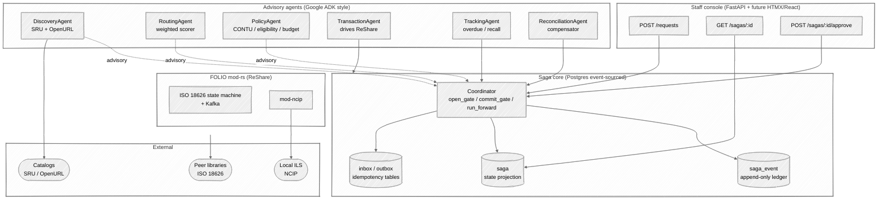
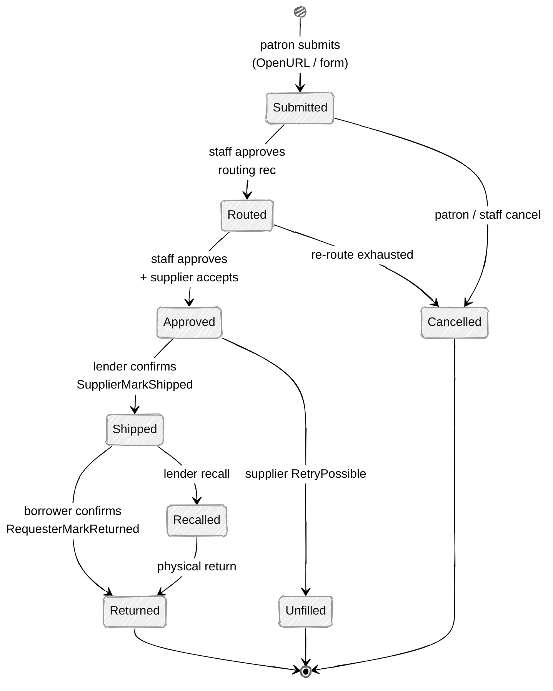
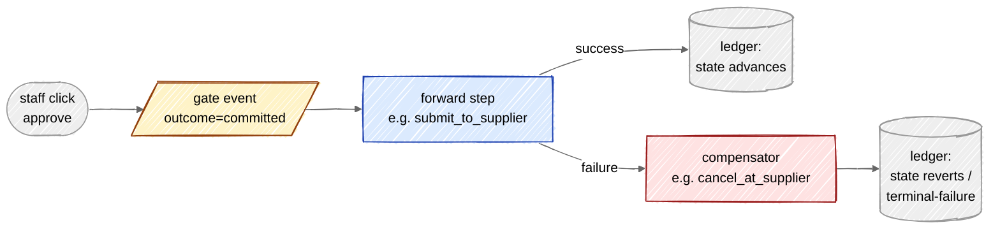
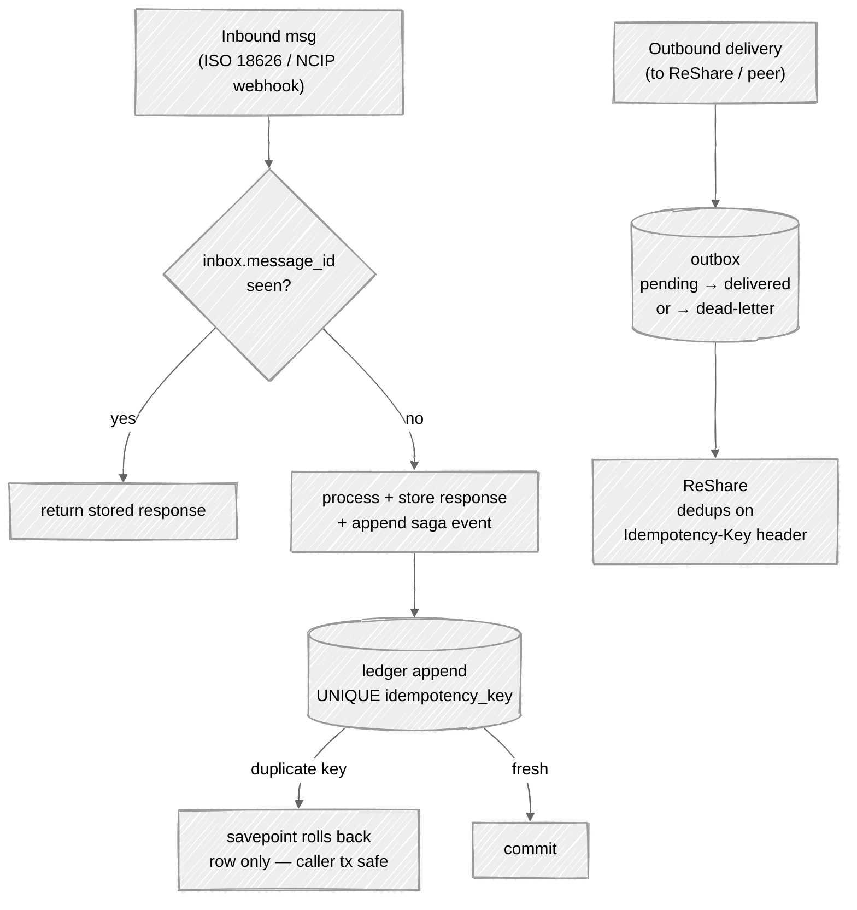
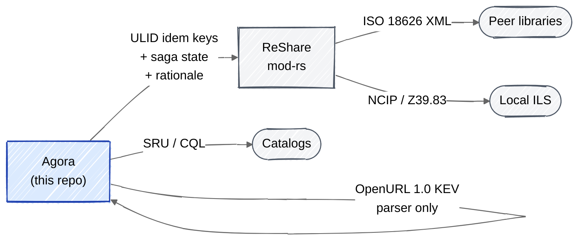

# Agora — Architecture (hand-drawn)

The diagrams below use Mermaid's hand-drawn (`look: handDrawn`) theme so
they read like a whiteboard sketch. GitHub renders them inline.

## Layer cake

## Lifecycle state machine

## Saga step anatomy (forward + compensator pair)

## Idempotency model

## Where standards live

## Notes

- Boxes in blue = Agora-owned. Boxes in grey = wrapped or external.
- Dashed arrows = advisory (recommendation only — does not commit).
- Solid arrows = state-changing call (committed via the saga ledger).
- The ledger is the source of truth; `saga.current_state` is a
  denormalised projection used by the staff console for cheap reads.
