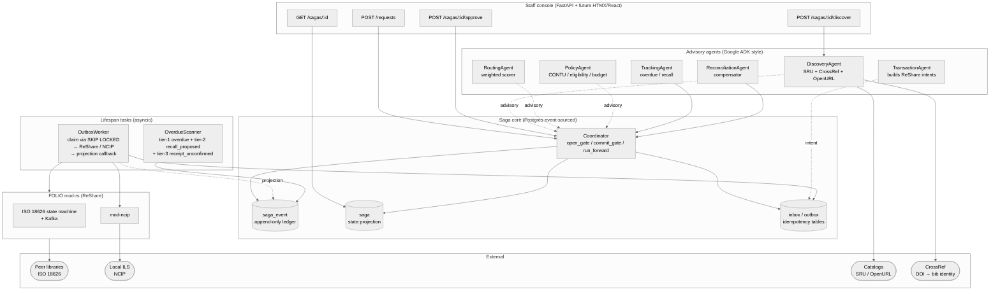
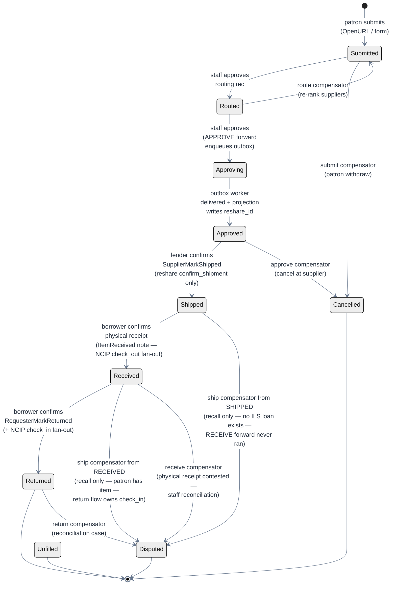
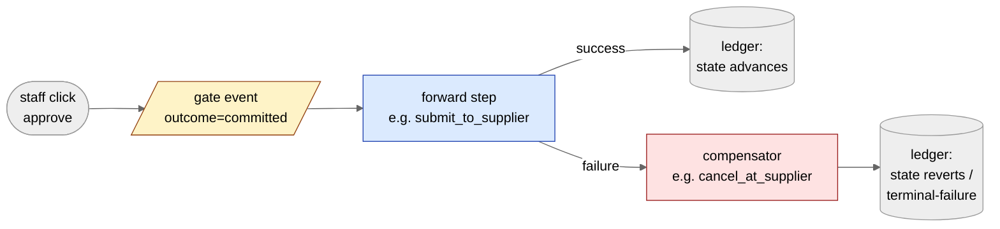
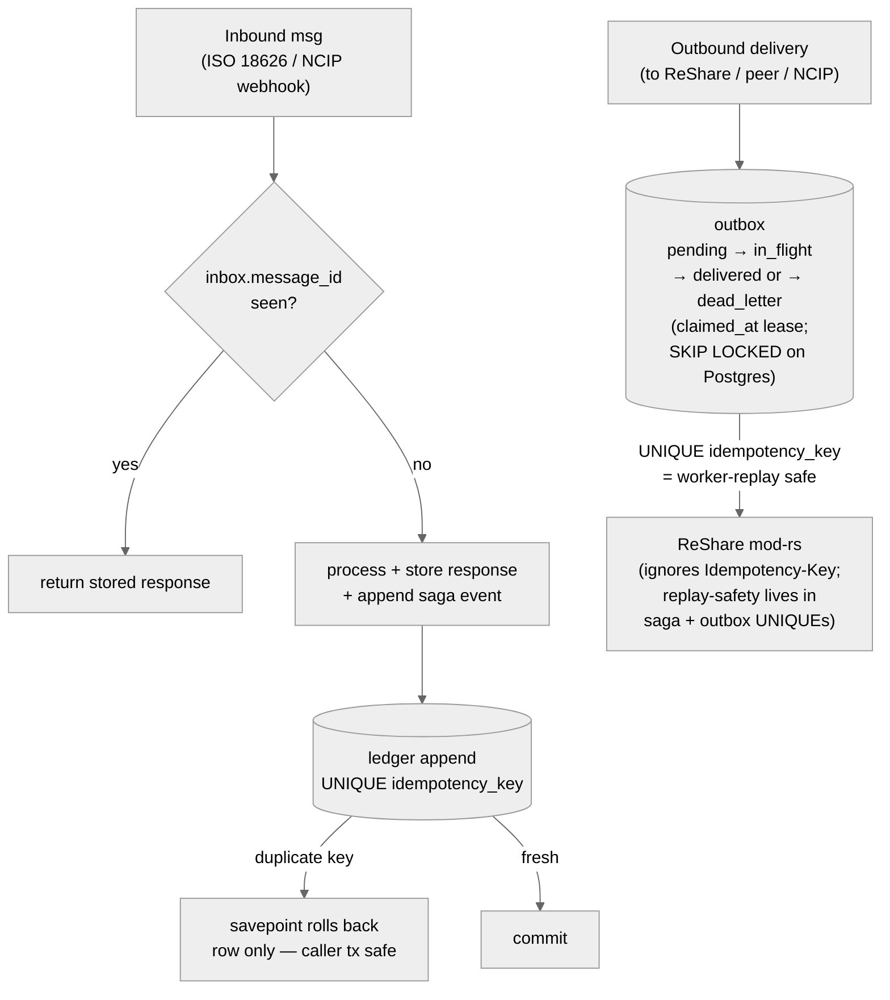
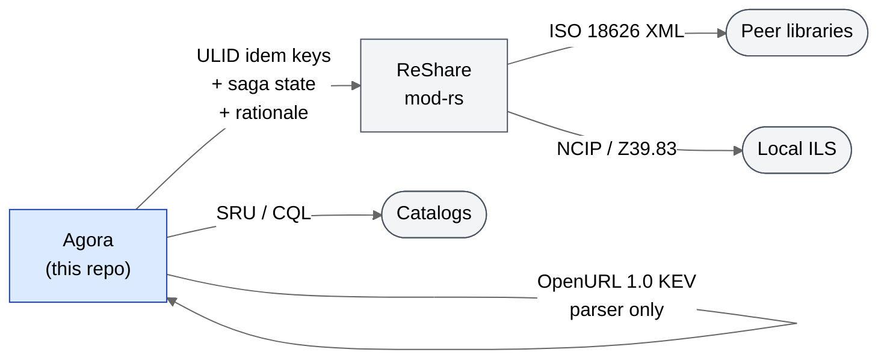

# Agora — Architecture

> Last reviewed against code: 2026-05-04 (post PRs #17/#18/#19/#24/
> #25/#28/#41-#54/#55-#90 + RECEIVED state + state-aware SHIP comp +
> NCIP-checkout SHIP→RECEIVE re-anchor + tier-3 receipt-unconfirmed watch +
> DiscoveryAgent endpoint wiring (#46/#53) + routing-LLM tie-breaker
> tuned (#51) + ISO 18626 XSD validation harness (#52) + NCIP item-barcode
> (#89) + override endpoint (#90) — APPROVING-via-outbox, NCIP fan-out,
> TrackingScanner lifespan task, alembic-on-real-postgres CI,
> multi-worker outbox, borrower-receipt state).

Diagrams pin `theme: neutral` so each block renders as a stable
light-palette box (dark text on light fills) regardless of the
viewer's GitHub light/dark preference — letting GitHub auto-remap
to dark would put white text on the classDef'd pastel node fills
and produce white-on-pastel that no one can read. Earlier revisions
also added `look: handDrawn` for a whiteboard aesthetic; that's
been retired because the hand-drawn cluster fills stack into
unreadable cross-hatch patterns when subgraphs sit side-by-side
(see Layer cake), and the sketch strokes go invisible against dark
backgrounds when GitHub does try to remap. Legibility beats
aesthetic.

## Layer cake

## Lifecycle state machine

States and compensator targets reflect `LifecycleState` and
`saga/flows.py`. Notes:

- `APPROVING` (per ADR-0012, PR #17) is the in-flight state between
  the staff click and the supplier ack: APPROVE forward enqueues an
  outbox `send_request` intent and advances to `APPROVING`; the
  worker drains the row, calls ReShare, and the projection callback
  writes an OBSERVATION carrying `reshare_id` that advances to
  `APPROVED`. Compensate during `APPROVING` returns 400 — there is
  no `reshare_id` to cancel against.
- No `Recalled` state in the enum — the SHIP compensator transitions
  to `Disputed` and enqueues a single ReShare `recall_request` outbox
  intent for staff intervention. Both branches (saga at `SHIPPED` or
  post-`RECEIVED`) converge on "just recall" post NCIP-checkout
  re-anchor: at `SHIPPED` no ILS loan was ever opened (RECEIVE forward
  never ran), at `RECEIVED` the patron physically holds the book so
  the loan correctly reflects custody and the eventual return flow
  owns `check_in`. The `current_state` check survives only as
  state-aware rationale text on the StepResult.
- `RECEIVED` is a borrower-side marker between `SHIPPED` and
  `RETURNED`: the saga records the patron's physical-receipt
  confirmation and emits a single NCIP `check_out` outbox intent
  against the borrower's local ILS (re-anchored from SHIP — patron
  record reflects the loan from the moment of physical receipt). The
  supplier-side ISO 18626 state stays `Loaned`. Compensator lands in
  `Disputed` because receipt is physically un-undoable; the ILS
  loan recorded by RECEIVE forward is left in place for staff
  reconciliation rather than blindly cleared.
- NCIP fan-out on RECEIVE/RETURN is fire-and-forget (CLAUDE.md
  known-gap). NCIP outcomes do not gate saga state — failures
  surface as stuck outbox rows for staff review.

## Saga step anatomy (forward + compensator pair)

## Idempotency model

**Replay-safety lives entirely in our two `UNIQUE` constraints**
(`saga_event.idempotency_key` and `outbox.idempotency_key`). mod-rs
predates the `Idempotency-Key` header convention and ignores it; the
`HttpReShareClient` still passes the header for handlers that do
honour it, but we do not depend on the external side for dedup.

## Where standards live

## Notes

- Boxes in blue = Agora-owned. Boxes in grey = wrapped or external.
- Dashed arrows = advisory (recommendation only — does not commit).
- Solid arrows = state-changing call (committed via the saga ledger).
- The ledger is the source of truth; `saga.current_state` is a
  denormalised projection used by the staff console for cheap reads.
