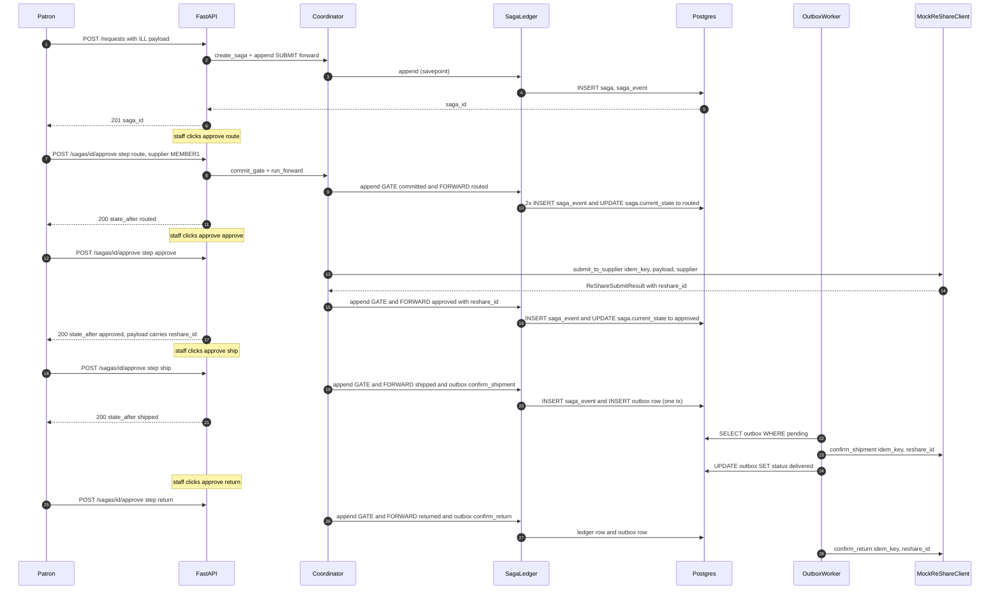

# Agora — Solution Design Document

> Last reviewed against code: 2026-05-05 (post PRs #41-#93 — outbox
> schema sync + APPROVE-via-outbox + runbook env-var backfill +
> DiscoveryAgent endpoint wiring (#46/#53) + routing-LLM tie-breaker
> tuned (#51) + ISO 18626 XSD validation harness (#52) + Vertex
> env-routing requirement for `eval-routing --llm` (#75) +
> `sync-doc-counts` script + pytest gate as single source of truth
> for test/ADR counts (#76) + RoutingAgent format-affinity feature
> (#79 closes routing-015, baseline 20/20) + staff console UI first
> slice via HTMX + Jinja2 (#80, ADR-0015) + NCIP item-barcode (#89)
> + override endpoint `POST /sagas/{id}/override` (#90) + override
> HTMX form (#92) + saga browser `GET /browser` (#93)).

Single-narrative design doc. Stitches together what the PRDs say
should exist, what the ADRs decided, what the code does today, and
why the seams sit where they do. Read this first if you're new to
the repo; deep-dive into PRDs, ADRs, runbook, and code from the
references at the end.

> **Status.** Research prototype. No production deployment. No real
> peers wired. Postgres + `MockReShareClient` by default. See
> `docs/adr/0007-fedramp-deferred.md`.

---

## 1. Problem statement & scope

### 1.1 What we're building

An agentic Inter-Library Loan (ILL) orchestrator for a multi-library
**consortium**. Wraps **FOLIO/ReShare (mod-rs)** for the standards
layer (ISO 18626, NCIP, SRU, OpenURL). Lifecycle is
`Submitted → Routed → Approved → Shipped → Received → Returned`, every
transition gated by a human staff click. Compensators are paired to
every forward step.

### 1.2 Why agents

ILL is a workflow-heavy domain: per-request triage today routinely
takes a librarian 5–15 manual decisions. NCIP automation already cuts
~50% of the steps; the hypothesis is that **agent orchestration over
standards-compliant ILL infrastructure** can compress more — without
removing the human from any state transition (legal/policy
liability).

### 1.3 What we explicitly do not build

- ISO 18626 wire-level XML serialisation. **mod-rs does that.** We
  drive mod-rs over REST.
- Auth, FedRAMP controls, multi-region HA. Out of scope per ADR-0007.
- Patron-facing UI; only a staff console.
- Z39.50 binary protocol; SRU only (ADR-0006).
- Real money / billing / payment.

### 1.4 Success criteria

- Full happy path runs end-to-end against `MockReShareClient` (the
  `agora.demos.happy_path` script).
- Saga ledger is replay-safe: re-issuing the same idempotency key is
  a no-op, never a duplicate.
- Compensator runs only against committed forwards; at-least-once
  delivery via outbox; mod-rs receives no double-deliveries.
- Forward step refuses to run without a committed gate event.
- All XML produced for peers passes the published ISO 18626 XSD —
  delegated to mod-rs.

---

## 2. Architecture overview

### 2.1 Layer cake

Top to bottom (full diagram in `docs/architecture.md`):

```
Staff console (FastAPI app + future HTMX/React)
    │
    ▼
Advisory agents — Discovery / Routing / Policy / Transaction / Tracking / Reconciliation
    │ recommendations + rationale (no commit power)
    ▼
Saga core — Coordinator + SagaLedger + StepRegistry
    │ append-only events + savepoint dedup + outbox enqueue
    ▼
Persistence — Postgres (saga, saga_event, inbox, outbox)
    │
    ▼
ReShare wrap — HttpReShareClient (real) / MockReShareClient (default)
    │
    ▼
External — peer libraries (ISO 18626 over mod-rs), local ILS (NCIP), catalogs (SRU/OpenURL)
```

### 2.2 The three anchors

**Saga ledger is the source of truth.** `saga.current_state` is a
denormalised projection from the ledger; never trust it over the
event stream.

**Coordinator, not engine.** ADR-0010. The coordinator is a small,
explicit, stateless object that reads the ledger and dispatches to
the registered step function. No internal state machine, no implicit
transitions. One method per concern: `open_gate`, `commit_gate`,
`run_forward`, `run_compensator`, `record_observation`.

**Outbox commit-then-enqueue.** ADR-0011 (extended by ADR-0012 to
cover APPROVE — see § 5.3). Every wire-touching step writes its
`OutboxIntent` rows in the *same* transaction as the ledger event
that produced them. The `OutboxWorker` drains rows asynchronously.
Replay-safety lives in two `UNIQUE` constraints:
`saga_event.idempotency_key` and `outbox.idempotency_key`.

---

## 3. Component walkthrough

### 3.1 API layer (`src/agora/api/`)

`create_app()` in `app.py` builds the FastAPI app and registers a
lifespan that spawns `OutboxWorker.run_forever` as an
`asyncio.Task`. Endpoints:

| Endpoint                             | Notes                                                      |
| ------------------------------------ | ---------------------------------------------------------- |
| `GET /health`                        | Liveness + version.                                        |
| `POST /requests`                     | Patron submit. Creates saga + initial SUBMIT forward.      |
| `GET /sagas`                         | List sagas (recent first).                                 |
| `GET /sagas/{id}`                    | Saga summary + full event timeline.                        |
| `POST /sagas/{id}/approve`           | Commit gate **and** run forward in one transaction.        |
| `POST /sagas/{id}/reject`            | Mark a pending gate `failed`; no forward runs.             |
| `POST /sagas/{id}/compensate`        | Run compensator for a previously committed forward.        |
| `POST /sagas/{id}/discover`          | Run DiscoveryAgent against the saga's stored request; writes a ROUTE-anchored OBSERVATION (#53). Saga state unchanged. |
| `POST /sagas/{id}/override`          | Resolve DISPUTED saga → CANCELLED or UNFILLED. Writes OBSERVATION (`step=resolve`, `outcome=committed`); no outbox dispatch (#90). |
| `GET /browser`                       | Saga browser — filter all sagas by state, library, date. Read-only UI endpoint (#93). |

`_APPROVABLE_STEPS = {ROUTE, APPROVE, SHIP, RETURN_ITEM}`. SUBMIT is
not gated (commits inside `POST /requests`); compensator-only steps
(CANCEL, REROUTE, REVOKE, RECALL, DISPUTE) are not directly
approvable.

Schemas live in `api/schemas.py` (pydantic v2). Settings are sourced
from `agora.config.get_settings()` (`@lru_cache`-decorated). Auth is
intentionally not implemented — ADR-0007.

### 3.2 Saga core (`src/agora/saga/`)

| Module          | Responsibility                                                                |
| --------------- | ----------------------------------------------------------------------------- |
| `db.py`         | SQLAlchemy ORM (`Saga`, `SagaEventRow`, `InboxRow`, `OutboxRow`); engine + sessionmaker. Portable UUID + BIGINT helpers for Postgres/SQLite. |
| `ledger.py`     | `SagaLedger`. Append uses `begin_nested()` savepoint so duplicate-key inserts return the existing row instead of poisoning the caller's tx.   |
| `coordinator.py`| `Coordinator`. The stateless orchestrator. Gate-required check before any forward.                                                            |
| `steps.py`      | `StepRegistry`, `StepResult`, `OutboxIntent`. The contract a step implements.                                                                 |
| `flows.py`      | The six forward+compensator pairs (SUBMIT, ROUTE, APPROVE, SHIP, RECEIVE, RETURN_ITEM) registered into the global `StepRegistry`.              |
| `idempotency.py`| `new_idempotency_key()` (ULID + prefix); `inbox_*`, `outbox_*` helpers.                                                                       |
| `outbox.py`     | `OutboxWorker.drain_once` / `drain_until_empty` / `run_forever`. Backoff, dead-letter, per-row session.                                       |
| `context.py`    | `SagaContext` — the immutable input bundle a step receives.                                                                                   |

### 3.3 Agents (`src/agora/agents/`)

All agents return a recommendation object with a `rationale` field.
**They never write to the saga ledger directly.** Staff click in the
console commits the gate.

| Agent                  | Status              | Inputs                            | Output                                 |
| ---------------------- | ------------------- | --------------------------------- | -------------------------------------- |
| `DiscoveryAgent`       | implemented + wired (#46/#53) | citation / OpenURL ctx + DOI    | candidate holders + DOI→CrossRef bib confirmation + rationale; staff invokes via `POST /sagas/{id}/discover` |
| `RoutingAgent`         | implemented         | candidates + consortium policy    | ranked supplier list + chosen          |
| `PolicyAgent`          | implemented         | request + patron + history        | hard/soft flags (CONTU, eligibility)   |
| `TransactionAgent`     | implemented         | wraps `ReShareClient`             | `submit_to_supplier()` returns reshare_id |
| `TrackingAgent` + `OverdueScanner` | implemented (no cron yet) | sagas in `shipped`     | overdue OBSERVATION events              |
| `ReconciliationAgent`  | implemented (thin)  | saga_id + step                    | thin wrapper around `Coordinator.run_compensator` |

### 3.4 Standards-edge clients (`src/agora/clients/`)

| Client                | Today                                                                                  |
| --------------------- | -------------------------------------------------------------------------------------- |
| `MockReShareClient`   | In-process default. Returns deterministic `reshare_id` strings.                        |
| `HttpReShareClient`   | Real HTTP wrapper for mod-rs. Endpoint paths verified against UrlMappings.groovy / PatronRequestController.groovy / Actions.groovy / ModuleDescriptor-template.json (see module docstring). Auth = HTTP Basic; production needs Okapi token. mod-rs ignores `Idempotency-Key` headers — replay-safety lives in the saga ledger UNIQUE. |
| `MockNcipClient`      | Mock-only. NCIP is on the roadmap but not yet implemented.                             |
| SRU client            | Implemented; talks to LoC by default. `get_sru_client()` factory selects mock vs HTTP via `AGORA_SRU_ENABLED` (default mock). |
| CrossRef client       | Implemented (#46); DOI → bibliographic identity (title, ISSN, ISBN, container, year). `get_crossref_client()` factory selects mock vs HTTP via `AGORA_CROSSREF_ENABLED` (default mock). |
| OpenURL parser        | Implemented; KEV format only.                                                          |

### 3.5 Models (`src/agora/models/`)

Pydantic v2 domain models: `IllRequest`, `PatronRef`, `LibraryRef`,
`Item`, `Citation`, `Candidate`. Saga events: `NewSagaEvent` (write),
`SagaEvent` (read). Lifecycle enums: `LifecycleState`, `StepName`,
`StepKind`, `StepOutcome`, `EventKind`, `Iso18626State`.
`TERMINAL_STATES = {RETURNED, CANCELLED, UNFILLED, DISPUTED}`.

---

## 4. Data model

### 4.1 Tables

```
saga
├── id                    UUID PK
├── request_id            UUID UNIQUE
├── current_state         VARCHAR(32)            # projection from saga_event
├── iso18626_state        VARCHAR(32) NULL
├── request_payload       JSONB
├── created_at / updated_at

saga_event                # append-only ledger; source of truth
├── id                    BIGINT PK
├── saga_id               UUID FK → saga.id (CASCADE)
├── seq                   INT       UNIQUE(saga_id, seq)
├── kind                  VARCHAR(32)            # forward | compensator | gate | observation
├── step                  VARCHAR(32)            # submit | route | approve | ship | return | cancel | reroute | revoke | recall | dispute
├── state_before          VARCHAR(32)
├── state_after           VARCHAR(32)
├── actor                 VARCHAR(255)
├── idempotency_key       VARCHAR(64)  UNIQUE    # ULID + prefix
├── iso_message_id        VARCHAR(128) NULL
├── payload               JSONB
├── outcome               VARCHAR(16)            # pending | committed | failed | skipped
├── rationale             VARCHAR(2048)
├── ts                    TIMESTAMPTZ

inbox                     # webhook dedup
├── message_id            VARCHAR(255) PK
├── source                VARCHAR(64)
├── received_at
├── response              JSONB NULL

outbox                    # outbound delivery queue
├── id                    BIGINT PK
├── saga_id               UUID
├── target                VARCHAR(64)            # reshare | ncip
├── idempotency_key       VARCHAR(64)  UNIQUE
├── payload               JSONB
├── status                VARCHAR(16)            # pending | in_flight | delivered | dead_letter
├── attempts              INT
├── last_error            VARCHAR(2048)
├── scheduled_for         TIMESTAMPTZ
├── delivered_at          TIMESTAMPTZ NULL
├── claimed_at            TIMESTAMPTZ NULL       # multi-worker lease (PR #25)
```

### 4.2 The two UNIQUE constraints that do all the work

1. `saga_event.idempotency_key` — every state transition writes one
   ledger row, keyed by a ULID. Replaying the same step with the
   same key returns the prior row instead of writing a duplicate.
2. `outbox.idempotency_key` — every wire intent gets one outbox row,
   keyed by the same ULID as its parent ledger event. The
   `OutboxWorker` passes this key into the handler so a worker crash
   followed by restart re-issues the wire call with the same key
   (mod-rs ignores it; we still preserve the contract for handlers
   that do honour it).

### 4.3 Portability

The schema is portable across Postgres and SQLite. `_PortableUUID`
TypeDecorator stores native UUID on Postgres, `CHAR(36)` on SQLite
(stdlib sqlite3 does not bind `uuid.UUID`). `_bigint_pk()` resolves
to `BIGINT` on Postgres, `INTEGER` on SQLite (SQLite only
auto-increments `INTEGER PRIMARY KEY`). `_json_type()` is JSONB on
Postgres, JSON on SQLite. Tests run on in-memory SQLite via
`Base.metadata.create_all()`; production runs on Postgres via
Alembic migrations.

---

## 5. End-to-end data flow

### 5.1 Happy path — narrated



### 5.2 Compensator path

`POST /sagas/{id}/compensate {step}` →
`Coordinator.run_compensator` → `find_committed_forward(step)` →
404 mapping to **409** if no committed forward exists → otherwise
runs the registered compensator → appends a COMPENSATOR ledger event
and any `OutboxIntent`s atomically.

Example: APPROVE compensator transitions `approved → cancelled` and
enqueues an `outbox(cancel_request)` row. Worker drains; mod-rs gets
the cancel.

### 5.3 APPROVE through the outbox (via `APPROVING`)

ADR-0012 closed the APPROVE-inline gap (PR #17). APPROVE forward is
now pure: it returns an `OutboxIntent` for `send_request` and
advances the saga to `LifecycleState.APPROVING`. The outbox worker
drains the row, calls the supplier, and the projection callback
(`make_reshare_on_success`) writes an OBSERVATION carrying
`reshare_id` that advances the saga to `APPROVED`. Downstream
SHIP/RETURN consume `reshare_id` via `_derive_extras`, which now
reads APPROVE OBSERVATION events as well as FORWARD events. The
projection runs **inside the same session** as
`outbox_mark_delivered`, so the OBSERVATION write and the delivered
flag commit atomically; a failed projection re-queues the row for
retry without leaving the saga half-advanced. Hitting `/compensate`
during the APPROVING window (supplier ack still pending) returns
400 — there is no `reshare_id` to cancel against.

---

## 6. Key design choices (linked to ADRs)

| Decision                                                    | ADR    | One-line rationale                                                                         |
| ----------------------------------------------------------- | ------ | ------------------------------------------------------------------------------------------ |
| Wrap FOLIO/ReShare; do not reimplement ISO 18626            | 0001   | mod-rs is production-tested; reimplementing the 2021 schema is yak-shaving.                |
| Event-sourced saga ledger as source of truth                | 0002   | Replay safety, audit trail, and compensator correctness all flow from append-only events.   |
| Google ADK for agent framework (with optional `[adk]` extra)| 0003   | Reusable patterns from prior project; ADK eval harness gives us agent-quality tests.        |
| Python + FastAPI                                            | 0004   | Async-first, pydantic v2 schema validation, fast iteration for prototype.                   |
| Human approval at every transition (default-deny autonomy)  | 0005   | Legal/policy liability — consortium staff stay accountable even when agents are right.      |
| SRU only; skip Z39.50 binary                                | 0006   | Most catalogs publish SRU; Z39.50 binary is a tarpit for a prototype.                       |
| FedRAMP alignment-noted only, not authorized                | 0007   | Research prototype, not a production deployment; controls are noted, not implemented.        |
| ULID idempotency keys with semantic prefix                  | 0008   | Lexicographic-sortable, monotonic, grep-friendly.                                            |
| Docker compose for local sandbox                            | 0009   | Postgres only today; FOLIO/ReShare brought up on demand from upstream recipe.                |
| Saga **coordinator**, not state-machine engine              | 0010   | Explicit > implicit. One method per concern. Restart and replay are trivially correct.       |
| Outbox commit-then-enqueue                                  | 0011   | Atomic `(ledger event, outbox row)` write. Replay-safe via `outbox.idempotency_key` UNIQUE.  |
| APPROVE forward via outbox + `APPROVING` waypoint state      | 0012   | Closes the inline-wire-call gap on APPROVE; supplier ack lands as a projection that writes `reshare_id`. |
| FOLIO Okapi token auth for `HttpReShareClient`               | 0013   | HTTP Basic for dev; setting `OKAPI_URL` switches to the FOLIO Okapi token flow for production. |
| Routing LLM tie-breaker (rules-first, LLM on near-ties only) | 0014   | Default-off seam + ADK Gemini Flash adapter; rules pick stays the bulk decision, LLM fires only when top-2 score gap ≤ ε. |

---

## 7. Cross-cutting concerns

### 7.1 Observability

- **structlog JSON logs**, configured in `agora.logging.configure_logging`.
  Saga ID, step, actor, and idempotency key are bound on every saga
  log line (`structlog.contextvars`).
- Key event names: `saga.forward.start`, `saga.forward.committed`,
  `saga.forward.failed`, `saga.compensator.start`,
  `saga.compensator.committed`, `outbox.delivered`,
  `outbox.retry_scheduled`, `outbox.dead_letter`,
  `saga.overdue_scan.complete`.
- OpenTelemetry traces are listed as future work — not wired today.

### 7.2 Security posture

- No auth in the prototype. The staff console assumes a trusted
  network (FedRAMP work, ADR-0007).
- ReShare HTTP Basic for dev; production needs the Okapi token flow.
- Secrets: scanned via `block_dangerous_git.py` / `scan_secrets.py`
  pre-commit hooks; never committed.
- `git commit --no-verify` is hook-blocked unless explicitly approved.

### 7.3 Scalability limits (today)

- One outbox drainer per DB. The `SELECT pending` query has no
  row-level lock; running two workers double-delivers. Postgres fix
  is `SELECT ... FOR UPDATE SKIP LOCKED`; SQLite cannot. Out of
  scope for prototype.
- API is async-first but has not been load-tested.
- No connection pooling tuning beyond `db_pool_size=10`.

### 7.4 Type safety

- `mypy --strict` runs clean against `src/` (36 files); CI gate.
- `tests/` is intentionally excluded — has stale `# type: ignore`
  markers and missing annotations. Future cleanup.
- Package ships a `py.typed` marker (PEP 561) so downstream consumers
  pick up inline types.

### 7.5 Test strategy

- 274 tests across unit, property (Hypothesis on compensator
  symmetry), and end-to-end (FastAPI + ASGITransport + in-memory
  SQLite), plus 6 postgres-only tests gated behind
  `AGORA_TEST_DB_URL` / the `postgres-tests.yml` CI service container.
- `pytest-asyncio` in `asyncio_mode = "auto"`.
- Demo (`agora.demos.happy_path`) is the user-visible smoke test.
- Routing eval harness wired (#47/#50): `make eval-routing` runs the
  rules-baseline; `python -m agora.evals.routing --llm` runs the
  LLM-augmented variant. CI gates the rules floor via
  `.github/workflows/routing-eval-floor.yml` (`--rules-only
  --check-floor` against `evals/routing/baseline-rules.json`); the
  LLM-augmented baseline (`evals/routing/baseline.json`) is read by
  PR review for quality regressions.

---

## 8. Alternatives considered

### 8.1 Roll our own ISO 18626 stack

Rejected (ADR-0001). The 2021 schema has multiple landmines
(`DeliveryMethod` rename, namespace drift, non-obvious required
header fields). mod-rs implements them correctly and is open-source.
We get more value from agent orchestration than from
schema-correctness yak-shaving.

### 8.2 In-memory state machine engine

Rejected (ADR-0010). Considered libraries like `transitions`,
`automat`, `sismic`. Each carries its own implicit-transition
behaviour and would have buried the saga semantics. The explicit
coordinator wins on debuggability — every transition is one named
method call against the ledger.

### 8.3 Inline wire calls (no outbox)

Rejected (ADR-0011, extended by ADR-0012 to cover APPROVE — see
§ 5.3). Inline calls couple wire failures to the saga's
transactional boundary: a flaky ReShare could roll back the ledger
event that already represented a real-world commitment. Outbox
decouples them.

### 8.4 LangGraph / LlamaIndex agent framework

Rejected (ADR-0003) in favour of Google ADK. Primary reason:
reusable patterns and eval harness from prior project. Switching
costs are low — agents are advisory-only; the contract is a single
recommendation object.

### 8.5 Z39.50 binary

Rejected (ADR-0006). Ugly protocol, sparse Python tooling, and most
catalogs publish SRU anyway. SRU covers the prototype scope.

---

## 9. Open risks & gaps

| Area                          | Risk / gap                                                                                                                |
| ----------------------------- | ------------------------------------------------------------------------------------------------------------------------- |
| `HttpReShareClient`           | Create-request body shape unverified vs `PatronRequest` Grails domain. Recall mapping unverified — raises until confirmed. |
| Auth                          | HTTP Basic only. Production needs Okapi token flow.                                                                       |
| ReconciliationAgent           | Thin wrapper today; lacks failure-classification policy (when to run which compensator automatically).                     |
| NCIP client                   | Mock-only.                                                                                                                |
| ISO 18626 XSD validation      | Validation harness (`scripts/validate_iso18626.py`) + minimal XSD/XML fixtures shipped #52; CI exercises plumbing on every PR. The real ISO 18626 v1.3 XSD is an opt-in cache step at `docs/standards/iso18626/` — not bundled. Wire-level conformance still delegated to mod-rs. |
| Observability (traces)        | structlog only. No OpenTelemetry yet.                                                                                     |
| PRD/architecture drift        | Stale-check pass ran 2026-05-04 (post PRs #25/#27/#28); 26 drift candidates across 6 files captured for follow-up PRs.    |
| Python version                | CI gates on 3.11 (`triple-gate.yml` + `audit.yml` + `postgres-tests.yml`); local dev on 3.14.3. No 3.12/3.13 matrix.       |

> **Recently closed** (kept here for changelog continuity; remove on next refresh):
> APPROVE forward inline → outbox via `APPROVING` (ADR-0012, PR #17).
> Outbox multi-worker → `FOR UPDATE SKIP LOCKED` + claim-via-status (PR #25).
> Alembic vs real Postgres → `tests/test_alembic_postgres.py` + `postgres-tests.yml` CI (PR #24).
> TrackingAgent cron → `OverdueScanner.run_forever` spawned from FastAPI lifespan.

All gaps are tracked in `CLAUDE.md`.

---

## 10. Glossary

| Term             | Meaning                                                                                                          |
| ---------------- | ---------------------------------------------------------------------------------------------------------------- |
| Saga             | A long-running business workflow expressed as a sequence of forward steps, each paired with a compensator.       |
| Ledger           | The append-only `saga_event` table; the source of truth for a saga's history.                                   |
| Forward step     | A state-advancing operation (e.g. ROUTE, APPROVE). Commits one FORWARD event on success.                         |
| Compensator      | The paired rollback for a forward step. Respects physical reality (item shipped → recall, not undo).             |
| Gate             | A pending GATE event awaiting human approval. Forward step refuses to run without a committed gate.              |
| Outbox intent    | A `(target, idempotency_key, payload)` triple that a step returns; written as an outbox row in the same tx.       |
| Idempotency key  | A ULID with a semantic prefix (e.g. `route-01HXY...`). Used as the UNIQUE fingerprint on ledger + outbox rows.    |
| ISO 18626        | The standard wire protocol for ILL between libraries. Implemented by mod-rs; we drive mod-rs over REST.          |
| NCIP             | Z39.83 — the protocol for talking to a local ILS for circulation events. Mock-only today.                        |
| SRU              | Search/Retrieve via URL — used for catalog discovery. Implemented for LoC.                                       |
| OpenURL          | KEV-format citation context strings. Implemented as a parser only.                                                |
| ULID             | Universally Unique Lexicographically Sortable Identifier. Used everywhere we need an idempotency key.            |
| ReShare          | Open-source consortium ILL platform built on FOLIO. We talk to its `mod-rs` REST API.                            |
| mod-rs           | The ReShare module that implements the ISO 18626 state machine. Our primary integration target.                  |
| Coordinator      | The stateless object that drives a single saga forward by reading the ledger and dispatching to the registry.    |
| Step registry    | The map from `StepName` to `(forward, compensator)` callable pair. Built by `flows.py`.                          |

---

## 11. References

### Repo

- `CLAUDE.md` — invariants, known gaps, behavioural rules
- `docs/runbook.md` — operational reference (bring-up, gate workflow, outbox, dead-letter triage)
- `docs/architecture.md` — Mermaid diagrams (layer cake, lifecycle state machine, idempotency model)
- `docs/prd/00-overview.md` … `06-non-functional.md` — product requirements (7 docs)
- `docs/adr/0001-…` … `0015-staff-console-htmx-jinja2.md` — architecture decisions (16 docs; latest: 0014 routing-LLM tie-breaker, 0015 staff console HTMX+Jinja2)
- `src/agora/api/app.py` — FastAPI factory + lifespan
- `src/agora/saga/coordinator.py` — coordinator
- `src/agora/saga/flows.py` — forward+compensator pairs
- `src/agora/saga/outbox.py` — outbox worker

### External

- ReShare / mod-rs: https://github.com/openlibraryenvironment/mod-rs
- mod-ncip: https://github.com/folio-org/mod-ncip
- ISO 18626:2021 spec — illtransactions.org
- LoC SRU: https://www.loc.gov/standards/sru/
- ULID spec: https://github.com/ulid/spec
